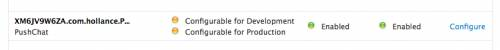

# APN Testing Suite

This contains a basic XCode iOS App that receives Apple Push Notifications and a simple Rails app that allows you to create and send push notifications to the iOS app.

You can send of the queued notifications by running `rake apn:notifications:deliver`.

You will need to place the generated pem file in `apn-webapp/config/apple_push_notification_development.pem` for the rails app to be able to send notifications.

_Instructions for generating the pem file is based off http://www.raywenderlich.com/3443/apple-push-notification-services-tutorial-part-12_

## Generating the Certificate Signing Request (CSR)

Open Keychain Access on your Mac (it is in Applications/Utilities) and choose the menu option **Request a Certificate from a Certificate Authority…**.

If you do not have this menu option or it says “Request a Certificate from a Certificate Authority with key”, then download and install the WWDR Intermediate Certificate first. Also make sure no private key is selected in the main Keychain Access window.

You should now see the following window:

Enter your email address here. I’ve heard people recommended you use the same email address that you used to sign up for the iOS Developer Program, but it seems to accept any email address just fine.

Enter “APNTest” for Common Name. You can type anything you want here, but choose something descriptive. This allows us to easily find the private key later.

Check **Saved to disk** and click **Continue**. Save the file as “APNTest.certSigningRequest”.

If you go to the Keys section of Keychain Access, you will see that a new private key has appeared 
in your keychain. Right click it and choose Export.

Save the private key as “APNTestKey.p12” and enter a passphrase.

For the convenience of this tutorial, I used the passphrase “apntest” to protect the p12 file but you should really choose something that is less easy to guess. The private key needs to be a secret, remember? Do choose a passphrase that you can recall, or you won’t be able to use the private key later.

## Making the App ID and SSL certificate

Log in to the [iOS Provisioning Portal](https://developer.apple.com/ios/manage/overview/index.action).

First, we are going to make a new App ID. Each push app needs its own unique ID because push notifications are sent to a specific application. (You cannot use a wildcard ID.)

Go to **App IDs** in the sidebar and click the **New App ID** button.

I filled in the fields as follows:

-  **Description:** APNTest
-  **Bundle Seed ID:** Generate New (this is the default option)
-  **Bundle Identifier:** com.bemo56.APNTest

It is probably best if you choose your own Bundle Identifier here – com.yoursite.APNTest – instead of using mine. You will need to set this same bundle ID in your Xcode project.

In a few moments, we will generate the SSL certificate that your push server uses to make a secure connection to APNS. This certificate is linked with your App ID. Your server can only send push notifications to that particular app, not to any other apps.

After you have made the App ID, it shows up like this in the list:

In the “Apple Push Notification service” column, there are two orange lights that say “Configurable for Development” and “Configurable for Production”. This means our App ID can be used with push, but we still need to set this up. Click on the **Configure** link to open the Configure App ID screen.

Check the **Enable for Apple Push Notification service** box and click on the **Configure** button for the Development Push SSL Certificate. The “Apple Push Notification service SSL Certificate Assistant” pops up:

The first thing it asks you is to generate a Certificate Signing Request. We already did that, so click **Continue**. In the next step you upload the CSR. Choose the CSR file that you generated earlier and click **Generate**.

It takes a few seconds to generate the SSL certificate. Click **Continue** when it’s done.

Now click **Download** to get the certificate – it is named “aps_developer_identity.cer”. Click **Done** to close the assistant and return to the Configure App ID screen.

As you can see, we have a valid certificate and push is now available for development. You can download the certificate again here if necessary. The development certificate is only valid for 3 months.

When you are ready to release your app, repeat this process for the production certificate. The steps are the same.

**Note:** The production certificate remains valid for a year, but you want to renew it before the year is over to ensure there is no downtime for your app.

You don’t have to add the certificate to your Keychain, although you could if you wanted to by double-clicking the downloaded aps_developer_identity.cer file. If you do, you’ll see that it is now associated with the private key.

## Making a PEM file

So now we have three files:

- The CSR
- The private key as a p12 file (APNTestKey.p12)
- The SSL certificate, aps_developer_identity.cer

Store these three files in a safe place. You could throw away the CSR but in my opinion it is easier to keep it. When your certificate expires, you can use the same CSR to generate a new one. If you were to generate a new CSR, you would also get a new private key. By re-using the CSR you can keep using your existing private key and only the .cer file will change.

We have to convert the certificate and private key into a format that is more usable for us. Because the push part of our server will be written in PHP, we will combine the certificate and the private key into a single file that uses the PEM format.

The specifics of what PEM is doesn’t really matter (in fact, I have no idea) but it makes it easier for PHP to use our certificate. If you write your push server in another language, these following steps may not apply to you.

We’re going to use the command-line OpenSSL tools for this. Open a Terminal and execute the following steps.

Go to the folder where you downloaded the files, in my case the Desktop:

    $ cd /Users/matthijs/Desktop

Convert the .cer file into a .pem file:

    $ openssl x509 -in aps_developer_identity.cer -inform der -out APNTestCert.pem

Convert the private key’s .p12 file into a .pem file:

    $ openssl pkcs12 -nocerts -out APNTestKey.pem -in APNTestKey.p12
    Enter Import Password: 
    MAC verified OK
    Enter PEM pass phrase: 
    Verifying - Enter PEM pass phrase: 

You first need to enter the passphrase for the .p12 file so that openssl can read it. Then you need to enter a new passphrase that will be used to encrypt the PEM file. Again for this tutorial I used “apntest” as the PEM passphrase. You should choose something more secure.

**Note:** if you don’t enter a PEM passphrase, openssl will not give an error message but the generated .pem file will not have the private key in it.

Finally, combine the certificate and key into a single .pem file:

    $ cat APNTestCert.pem APNTestKey.pem > ck.pem

At this point it’s a good idea to test whether the certificate works. Execute the following command:

    $ telnet gateway.sandbox.push.apple.com 2195
    Trying 17.172.232.226...
    Connected to gateway.sandbox.push-apple.com.akadns.net.
    Escape character is '^]'.

This tries to make a regular, unencrypted, connection to the APNS server. If you see the above response, then your Mac can reach APNS. Press Ctrl+C to close the connection. If you get an error message, then make sure your firewall allows outgoing connections on port 2195.

Let’s try connecting again, this time using our SSL certificate and private key to set up a secure connection:

    $ openssl s_client -connect gateway.sandbox.push.apple.com:2195 -cert APNTestCert.pem -key APNTestKey.pem
    Enter pass phrase for APNTestKey.pem:

You should see a whole bunch of output, which is openssl letting you know what is going on under the hood.

If the connection is successful, you should be able to type a few characters. When you press enter, the server should disconnect. If there was a problem establishing the connection, openssl will give you an error message but you may have to scroll up through the output to find it.

**Note:** that there are actually two different APNS servers: the “sandbox” server that you can use for testing, and the live server that you use in production mode. Above, we used the sandbox server because our certificate is intended for development, not production use.

## Making the Provisioning Profile

We’re not done yet in the Provisioning Portal. Go to Provisioning in the sidebar and click **New Profile**.

This is how I filled in the fields:

- **Profile Name:** APNTest Development
- **Certificates:** check your certificate
- **App ID:** APNTest
- **Devices:** check your devices

This isn’t different from generating any other provisioning profile, which you’ve probably done before. We’re making a new profile because each push app needs to have its own profile that is connected to the proper App ID.

Click **Submit** and the profile will be generated. The new profile will be in the Pending state. Refresh the Development Provisioning Profiles page; the status should have changed to Active and you can download the file (named APNTest_Development.mobileprovision).

Add the provisioning profile to Xcode by double-clicking it or dragging it onto the Xcode icon.

If you’re reading to release your app to the public, you will have to repeat this process to make an Ad Hoc or App Store distribution profile.

## A Very Basic App

The app is setup to use the APNTest certificate, you will need to change this based on your account/preferences.